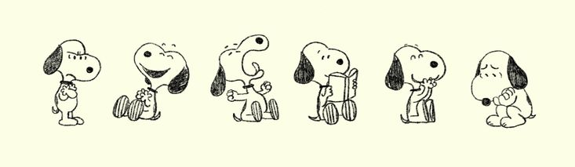
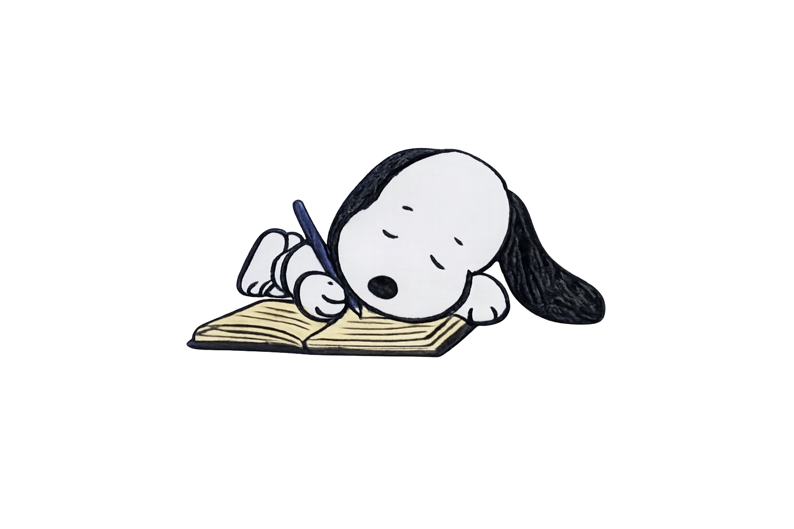

  

<h3>👩‍💻 Sobre Mim</h3>

Olá! Eu sou a Gabrielle.

Estudante de Análise e Desenvolvimento de Sistemas apaixonada por tecnologia e desenvolvimento web.

Atualmente desenvolvendo minhas habilidades em programação através de projetos e estudos constantes.

<h3> 🚀 O Que Me Motiva </h3>

Acredito que o crescimento acontece nos desafios. Cada dificuldade é uma oportunidade para aprender, evoluir e me tornar uma versão melhor de mim mesma.

Busco encarar as provações como parte do processo, desenvolvendo resiliência, conhecimento e experiência a cada passo da jornada.

## 🌱 Atualmente Estudando

- HTML e CSS
- Git e GitHub
- Lógica de Programação
- Desenvolvimento Web

